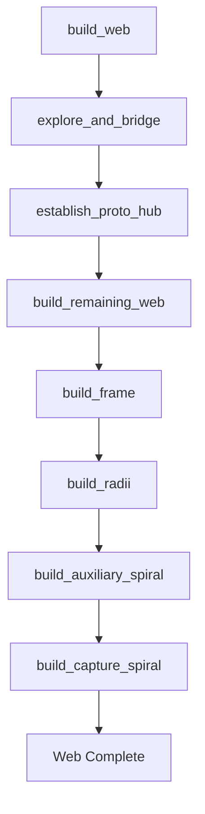

# Orb Web Construction HTN Planner

This document provides an overview of the Hierarchical Task Network (HTN) planner developed to model the orb web construction behavior of *Araneus diadematus* (European garden spider), based on the 1996 research by Samuel Zschokke.

---

## 1. Introduction
The goal of this project is to bridge biological observation and computational artificial intelligence by simulating how spiders weave orb webs. Using HTN planning, we model the sequence of physical decisions made by the spider as it constructs its web within a laboratory setup.

---

## 2. Recap of Zschokke (1996) Paper
### *Early Stages of Orb Web Construction in Araneus diadematus Clerck*

Samuel Zschokke's research identified two distinct behavioral phases during web construction:

1. **Early Stage (Exploration & Proto-hub)**:
   * **Opportunistic & Variable**: Spiders do not follow a single, fixed pattern. They explore, construct bridge threads, and establish a proto-hub dynamically based on wind, stick structure, and environmental feedback.
   * **Alternative Traversals**: Spiders use three distinct physical methods to cross gaps or build connections:
     * **Walking** along existing structures/detours.
     * **Dropping** vertically using a dragline.
     * **Swinging (Tarzan Method)**: Dropping and swinging to catch onto another thread or structure.
2. **Late Stage (Frame, Radii, Spirals)**:
   * **Algorithmic & Stereotyped**: Highly predictable, rigid, and sequential. The spider follows a genetically/neuronally programmed pattern.
   * **Sequence**: Construct the top frame thread first, build the remaining frames, construct the radii by circling the hub and filling gaps, build the auxiliary (temporary) spiral, and finally build the capture (sticky) spiral.
3. **Energy Expenditure**:
   * Zschokke used the distance walked by the spider as a proxy for metabolic energy. Because the spider leaves a dragline as it moves, distance walked matches the silk produced and locomotor energy used.

---

## 3. Introduction to GTPyhop
**GTPyhop** is a Hierarchical Task Network (HTN) planner implemented in Python 3 (developed by Dana Nau as a successor to Pyhop).

### How it Works:
* **State**: A Python object representing the current state of the world (e.g., spider's location, active thread connections, and progress metrics).
* **Operators (Actions)**: Atomic primitive actions that mutate the state. Each operator defines preconditions that must be met to execute.
* **Methods**: High-level tasks defined by rules that decompose them into lists of simpler subtasks.
* **Backtracking Search**: If a chosen method leads to a dead end (where future task preconditions cannot be satisfied), GTPyhop backtracks and attempts alternative methods.

### Suitability:
HTN is ideal for this model because:
1. We can define **multiple alternative methods** for the early exploration stages to simulate the spider's opportunistic behavior (backtracking among `via_walk`, `via_drop`, and `via_tarzan`).
2. We can define a **single deterministic method** for the late stage to simulate the rigid, stereotyped behavioral program.

---

## 4. Code Architecture & Implementation
The code is structured as a modular Python package under `spider_web_htn/`:

```
btp/
├── run.py                    # Top-level entry point to execute the planner
├── spider_web_htn/           # Main package
│   ├── state.py              # WebState tracking coordinates, threads, and energy
│   ├── operators.py          # The 9 primitive actions (walk, drop, swing, etc.)
│   ├── methods.py            # HTN method decompositions (early and late stages)
│   ├── utils.py              # Euclidean distance metrics and graph helpers
│   └── main.py               # Domain setup, planning runner, and output reporting
```

### Flow of the Planner:


---

## 5. Environmental Geometry & Coordinates
The environmental layout replicates Zschokke's lab frame: a U-shaped structure (18 cm high × 16 cm wide) containing stick supports and a horizontal crossbar.

### Coordinate System:
* **Origin `(0.0, 0.0)`**: Bottom-left corner of the frame.
* **X-axis**: Horizontal distance (cm).
* **Y-axis**: Vertical height (cm).

### Reference Coordinates:

| Node Name | Coordinates (x, y) | Description |
| :--- | :--- | :--- |
| `left_stick_top` | `(0.0, 18.0)` | Top of left stick |
| `right_stick_top` | `(16.0, 18.0)` | Top of right stick (Spider starting position) |
| `proto_hub` | `(8.0, 12.0)` | Spatial center of the web |
| `bottom_path` | `(8.0, 0.0)` | Center of the detour floor |
| `anchor_top_center` | `(8.0, 18.0)` | Top anchor point |
| `anchor_left_upper` | `(0.0, 15.0)` | Upper left stick anchor |
| `anchor_left_lower` | `(0.0, 6.0)` | Lower left stick anchor |
| `anchor_right_upper` | `(16.0, 15.0)` | Upper right stick anchor |
| `anchor_right_lower` | `(16.0, 6.0)` | Lower right stick anchor |

---
